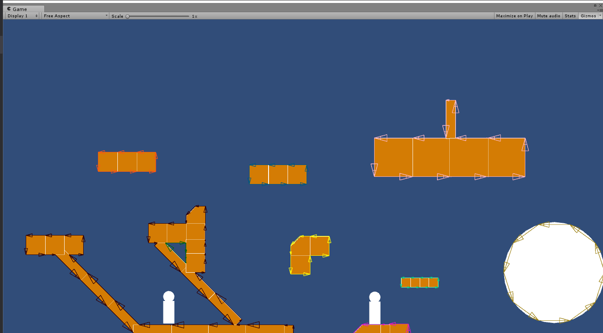

# Pathfinding2D

UNFINISHED (Currently working on this project in a private repository)

This is a Unity3d-plugin, that supports 2d navigation based on walkable lines. It allows for navigation on ceilings, walls and the ground.

